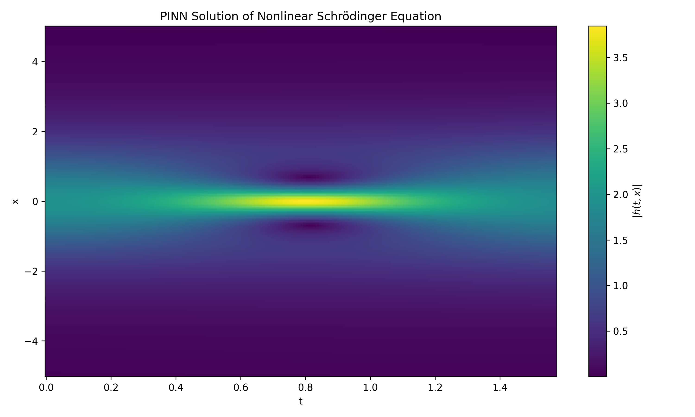
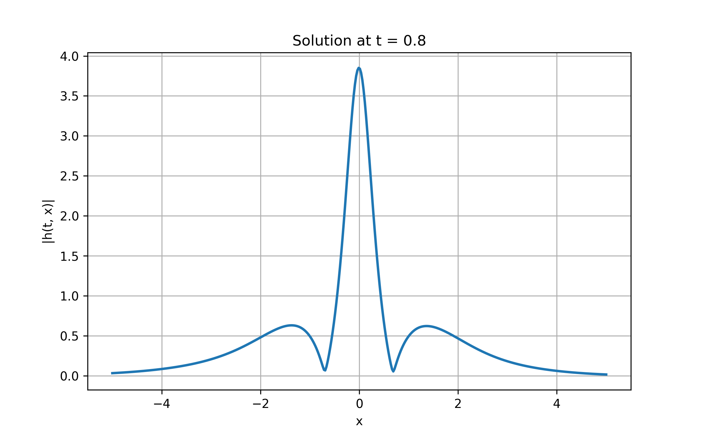

# Nonlinear Schrödinger Equation using Physics-Informed Neural Networks

This project implements a Physics-Informed Neural Network (PINN) to solve the one-dimensional Nonlinear Schrödinger Equation (NLSE). The network learns the solution directly by minimizing the governing equation residual along with the initial and boundary conditions using automatic differentiation.

---

## Overview

The Nonlinear Schrödinger Equation is a fundamental nonlinear partial differential equation that appears in quantum mechanics, nonlinear optics, plasma physics, and wave propagation.

Instead of relying on traditional mesh-based numerical methods, this project uses a Physics-Informed Neural Network to approximate the solution over the entire spatio-temporal domain.

---

## Governing Equation

The equation solved is

$$
i h_t + \frac{1}{2} h_{xx} + |h|^2 h = 0
$$

where:

- $h(x,t)$ is the complex wave function
- $i$ is the imaginary unit
- $h_t$ is the time derivative
- $h_{xx}$ is the second spatial derivative

---

## Methodology

The PINN framework consists of:

- Fully connected neural network
- Automatic differentiation for derivative computation
- PDE residual minimization
- Initial condition enforcement
- Boundary condition enforcement

The total loss is constructed from:

- PDE loss
- Initial condition loss
- Boundary condition loss

---

## Project Structure

```text
1_nonlinear_schrodinger
│
├── PINN
│   ├── data.py
│   ├── model.py
│   ├── physics.py
│   ├── train.py
│   ├── visualize.py
│   └── run_nlse.py
│
└── README.md
```

---

## Running the Project

Execute:

```bash
python PINN/run_nlse.py
```

The script trains the PINN and generates solution visualizations.

---

## Results

### Space-Time Solution

The learned spatio-temporal solution magnitude \( |h(t,x)| \).



---

### Time Slice at t = 0.8

Predicted solution profile at a fixed time.



---

## Observations

- The PINN successfully captures the localized wave structure.
- The solution remains concentrated around the center of the domain.
- Spatial symmetry is preserved throughout the simulation.
- The generated time slice shows the characteristic nonlinear wave profile expected from the NLSE.

---

## References

M. Raissi, P. Perdikaris, G. E. Karniadakis,

**Physics-Informed Neural Networks: A Deep Learning Framework for Solving Forward and Inverse Problems Involving Nonlinear Partial Differential Equations**, Journal of Computational Physics, 2019.
