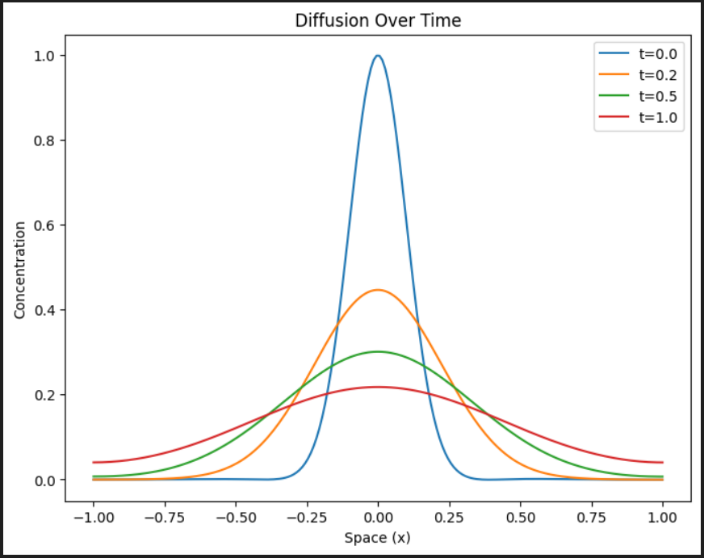
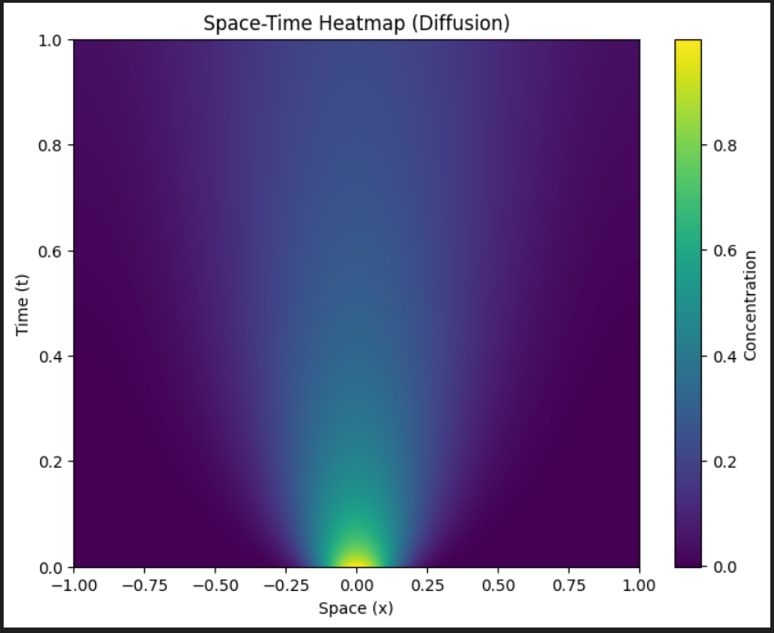
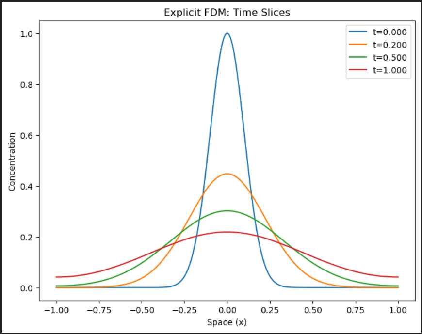
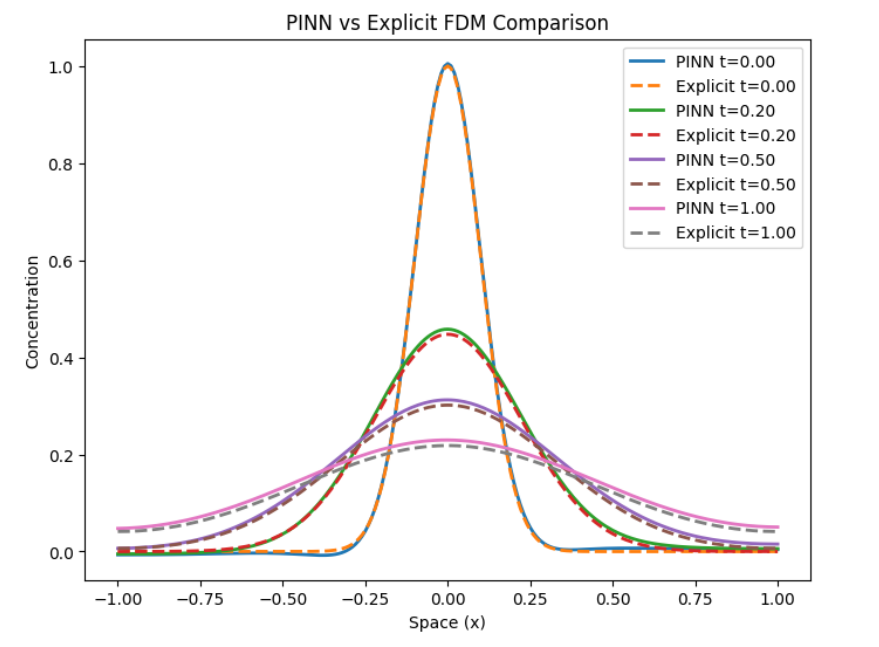

# 1D Diffusion Equation: PINN vs Finite Difference Method

This project compares a Physics-Informed Neural Network (PINN) and an Explicit Finite Difference Method (FDM) for solving the one-dimensional diffusion equation.

The objective is to evaluate the ability of PINNs to reproduce the dynamics of a classical diffusion process and compare their predictions with a traditional numerical solver.

---

## Overview

Diffusion equations describe the transport of heat, particles, and other physical quantities through a medium.

This project implements:

- Physics-Informed Neural Network (PINN)
- Explicit Finite Difference Method (FDM)

Both methods solve the same diffusion problem and their solutions are compared qualitatively and quantitatively.

---

## Governing Equation

The one-dimensional diffusion equation is

\[
\frac{\partial u}{\partial t}
=
D
\frac{\partial^2 u}{\partial x^2}
\]

where

- \(u(x,t)\) is the diffusing quantity
- \(D\) is the diffusion coefficient

---

## Methods

### PINN

The Physics-Informed Neural Network enforces:

- PDE residual loss
- Initial condition loss
- Boundary condition loss

using automatic differentiation.

---

### Explicit Finite Difference Method

The FDM implementation uses a Forward-Time Central-Space (FTCS) scheme:

\[
u_i^{n+1}
=
u_i^n
+
r
\left(
u_{i+1}^n
-
2u_i^n
+
u_{i-1}^n
\right)
\]

where

\[
r = \frac{D\Delta t}{\Delta x^2}
\]

and stability requires

\[
r \le 0.5
\]

---

## Project Structure

```text
2_diffusion_basic
│
├── 01_PINN
│   ├── data.py
│   ├── model.py
│   ├── physics.py
│   ├── train.py
│   ├── visualize.py
│   └── run_diffusion.py
│
├── 02_FDM
│   ├── solver.py
│   ├── visualize.py
│   └── run_diffusion_FDM.py
│
└── README.md
```

---

## Running the Project

### PINN

```bash
python 01_PINN/run_diffusion.py
```

### FDM

```bash
python 02_FDM/run_diffusion_FDM.py
```

---

## Results

### PINN Solution

#### Diffusion Evolution



#### PINN Heatmap



---

### FDM Solution

#### Diffusion Evolution



#### FDM Heatmap


---

### PINN vs FDM Comparison



---

## Observations

- Both methods reproduce the expected diffusion behaviour.
- The initial concentration profile gradually broadens with time.
- Peak amplitude decreases as diffusion progresses.
- PINN predictions closely follow the numerical FDM solution.
- The comparison demonstrates that PINNs can accurately approximate diffusion dynamics without explicitly discretizing the computational domain.

---

