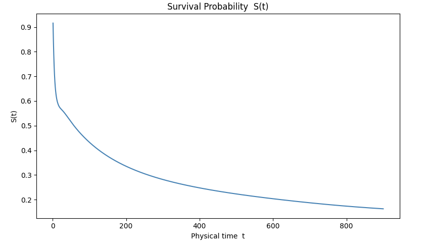
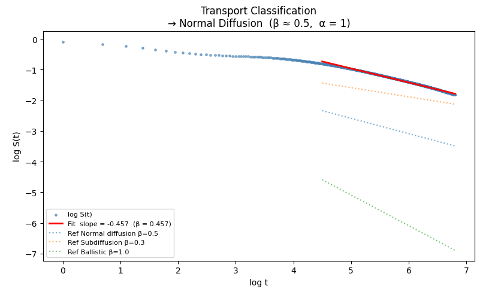
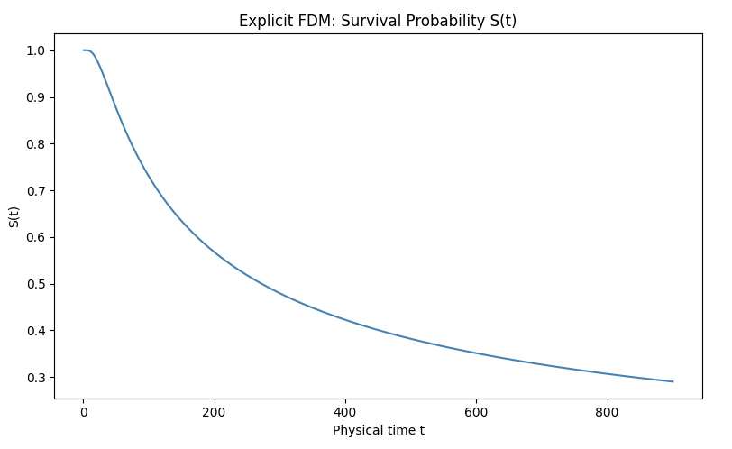
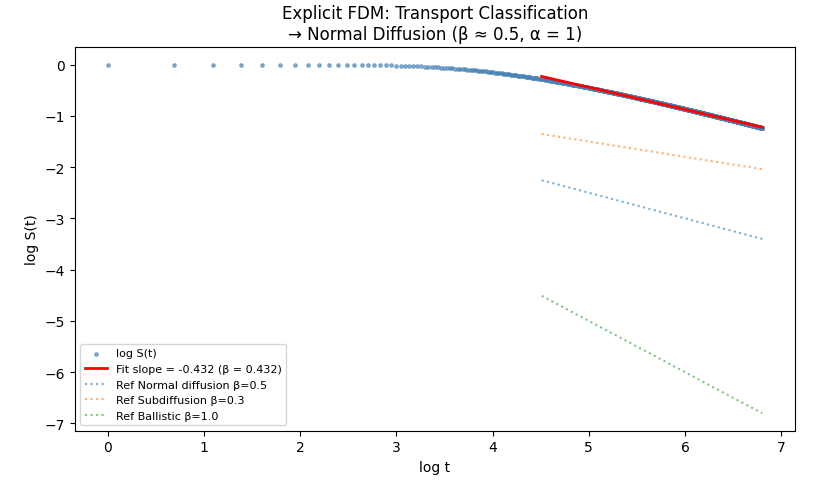
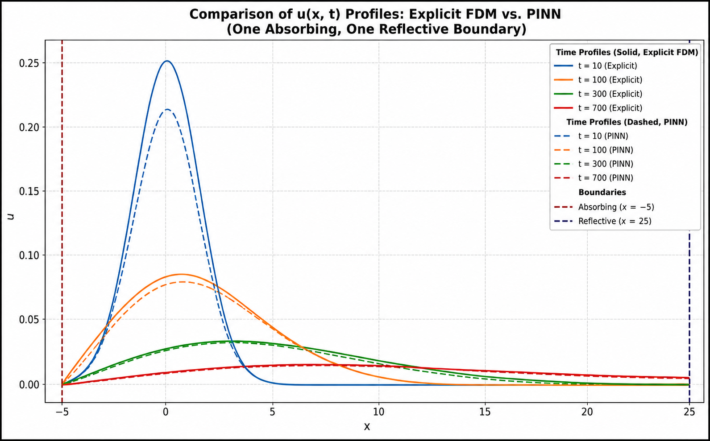

# Asymmetric Boundary Diffusion
## One Absorbing Boundary and One Reflecting Boundary

This project investigates diffusion in a finite one-dimensional domain with asymmetric boundary conditions:

- Left Boundary: Absorbing
- Right Boundary: Reflecting

Both a Physics-Informed Neural Network (PINN) and an Explicit Finite Difference Method (FDM) are implemented and compared. The study focuses on how asymmetric boundaries influence particle survival and transport behaviour.

---

## Overview

Unlike symmetric diffusion systems, asymmetric boundaries introduce directional effects into the transport process.

The absorbing boundary continuously removes probability density from the system, while the reflecting boundary prevents escape on the opposite side.

This project analyzes:

- Diffusion dynamics
- Survival probability
- Transport classification
- Long-time decay behaviour

using both PINNs and classical numerical methods.

---

## Governing Equation

The diffusion equation is

\[
\frac{\partial u}{\partial t}
=
D
\frac{\partial^2 u}{\partial x^2}
\]

where

- \(u(x,t)\) is the probability density
- \(D\) is the diffusion coefficient

---

## Boundary Conditions

### Left Boundary (Absorbing)

\[
u(x_{\text{left}},t)=0
\]

Particles reaching the boundary are removed from the system.

---

### Right Boundary (Reflecting)

\[
\frac{\partial u}{\partial x}
\Bigg|_{x=x_{\text{right}}}
=
0
\]

No probability flux crosses the boundary.

---

## Analysis Performed

### Survival Probability

The total probability remaining inside the domain:

\[
S(t)
=
\int u(x,t)\,dx
\]

---

### Transport Classification

The long-time survival decay is fitted using

\[
S(t)\sim t^{-\beta}
\]

where

- \(\beta \approx 0.5\) → Normal Diffusion
- \(\beta < 0.5\) → Subdiffusion
- \(\beta > 0.5\) → Superdiffusion

---

### Log-Log Decay Analysis

Linear regression is performed in log-log space to estimate the transport exponent.

---

## Methods

### PINN

The PINN enforces:

- Diffusion equation residual
- Initial condition
- Absorbing boundary condition
- Reflecting boundary condition

through automatic differentiation.

---

### Explicit FDM

The FDM implementation uses the FTCS scheme together with:

- Dirichlet condition at the absorbing boundary
- Neumann condition at the reflecting boundary

---

## Project Structure

```text
3_asymmetric_boundary_1_absorbing_1_reflecting
│
├── 01_PINN
│   ├── data.py
│   ├── model.py
│   ├── physics.py
│   ├── train.py
│   ├── transport_metrics.py
│   ├── visualize.py
│   └── run_asymmetric_diffusion.py
│
├── 02_FDM
│   ├── solver.py
│   ├── transport_metrics.py
│   ├── visualize.py
│   └── run_asymmetric_fdm.py
│
└── README.md
```

---

## Running the Project

### PINN

```bash
python 01_PINN/run_asymmetric_diffusion.py
```

### FDM

```bash
python 02_FDM/run_asymmetric_fdm.py
```

---

## Results

### PINN Survival Probability



---

### PINN Transport Classification



---

### FDM Survival Probability



---

### FDM Transport Classification



---

### PINN vs FDM Comparison



---

## Key Observations

- Probability decreases continuously due to the absorbing boundary.
- The reflecting boundary prevents escape from one side of the domain.
- Both PINN and FDM reproduce the expected asymmetric diffusion behaviour.
- Survival probability exhibits power-law decay characteristics.
- Transport exponents obtained from PINN closely match those obtained from the numerical FDM solution.

---

