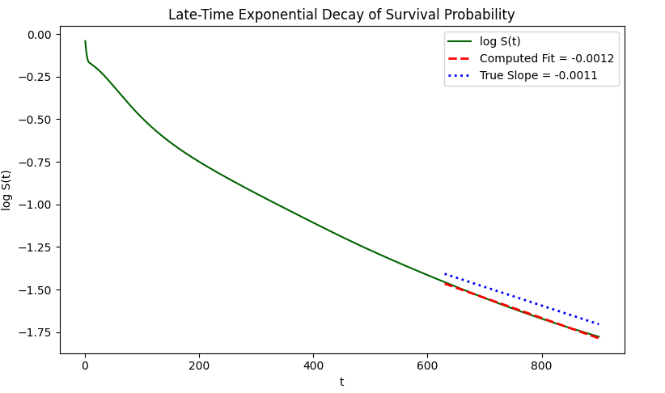
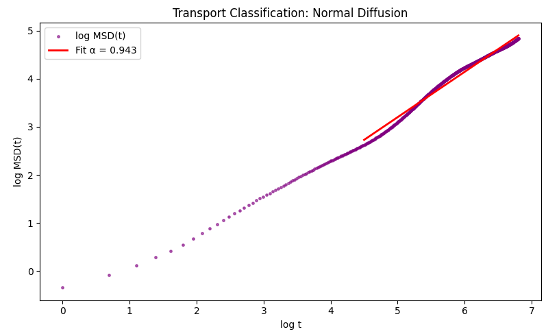
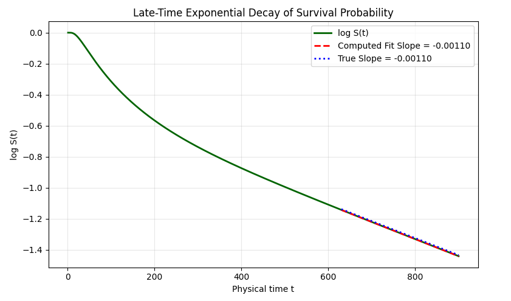
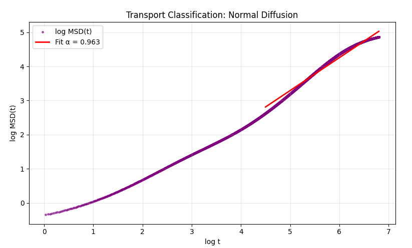
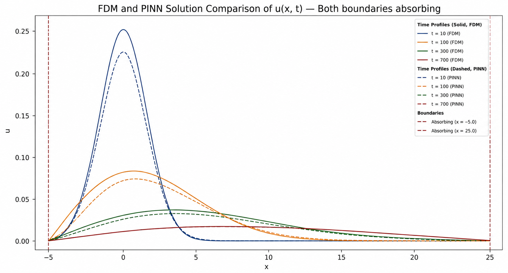

# Asymmetric Boundary Diffusion
## Both Boundaries Absorbing

This project investigates diffusion in a finite one-dimensional domain with absorbing boundaries at both ends. The study compares Physics-Informed Neural Networks (PINNs) and Explicit Finite Difference Methods (FDMs) for modeling particle transport, survival probability decay, and diffusion classification.

Unlike the mixed boundary case, particles can escape through both ends of the domain, resulting in faster probability loss and distinct transport characteristics.

---

## Overview

The system consists of a finite domain bounded by two absorbing boundaries:

- Left Boundary: Absorbing
- Right Boundary: Absorbing

A Gaussian probability distribution is initialized near the center of the domain and evolves according to the diffusion equation.

The project analyzes:

- Survival probability
- Mean Square Displacement (MSD)
- Transport classification
- Late-time exponential decay
- PINN vs FDM agreement

---

## Governing Equation

The one-dimensional diffusion equation is

\[
\frac{\partial u}{\partial t}
=
D
\frac{\partial^2 u}{\partial x^2}
\]

where

- \(u(x,t)\) is the probability density
- \(D\) is the diffusion coefficient

---

## Boundary Conditions

### Left Boundary

\[
u(x_{\text{left}},t)=0
\]

### Right Boundary

\[
u(x_{\text{right}},t)=0
\]

Both boundaries absorb probability density reaching the edges of the domain.

---

## Analysis Performed

### Survival Probability

The total probability remaining inside the domain:

\[
S(t)
=
\int u(x,t)\,dx
\]

As particles leave through both boundaries, \(S(t)\) decreases continuously with time.

---

### Mean Square Displacement (MSD)

The transport dynamics are characterized using

\[
MSD(t)
=
\left\langle (x-x_0)^2 \right\rangle
\]

which measures the spatial spread of the surviving particles.

---

### Transport Classification

Transport behaviour is determined from

\[
MSD(t)
\sim
t^{\alpha}
\]

where

- \(\alpha < 1\) → Subdiffusion
- \(\alpha \approx 1\) → Normal Diffusion
- \(\alpha > 1\) → Superdiffusion

---

### Late-Time Survival Decay

The long-time behaviour of the survival probability is examined through

\[
\ln S(t)
\]

and compared against the theoretical exponential decay rate.

---

## Methods

### PINN

The Physics-Informed Neural Network enforces:

- Diffusion equation residual
- Initial condition
- Left absorbing boundary
- Right absorbing boundary

through automatic differentiation.

---

### Explicit FDM

The FDM implementation uses the FTCS finite difference scheme with absorbing Dirichlet boundary conditions at both ends of the domain.

The numerical solution serves as a reference for validating PINN predictions.

---

## Project Structure

```text
4_asymmetric_boundary_both_absorbing
│
├── 01_PINN
│   ├── data.py
│   ├── model.py
│   ├── physics.py
│   ├── train.py
│   ├── transport_metrics.py
│   ├── visualize.py
│   └── run_two_absorbing_diffusion.py
│
├── 02_FDM
│   ├── solver.py
│   ├── transport_metrics.py
│   ├── visualize.py
│   └── run_two_absorbing_fdm.py
│
└── README.md
```

---

## Running the Project

### PINN

```bash
python 01_PINN/run_two_absorbing_diffusion.py
```

### FDM

```bash
python 02_FDM/run_two_absorbing_fdm.py
```

---

## Results

### PINN Survival Probability



---

### PINN MSD Analysis



---

### FDM Survival Probability



---

### FDM MSD Analysis



---

### PINN vs FDM Comparison



---

## Key Observations

- Probability decreases more rapidly than the mixed boundary case because particles can escape through both ends.
- Mean Square Displacement initially follows normal diffusive behaviour.
- Survival probability exhibits exponential decay at late times.
- The decay rate agrees with theoretical expectations for a finite absorbing domain.
- PINN predictions closely match the FDM reference solution for both survival probability and transport metrics.

---

