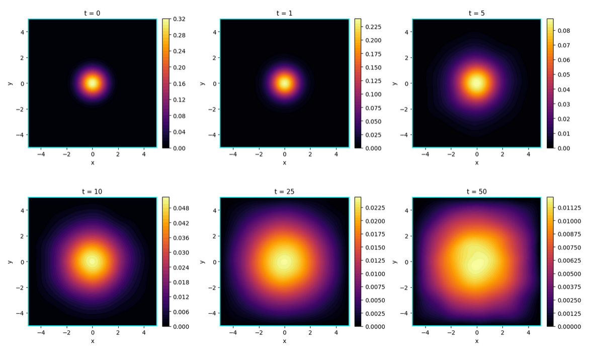
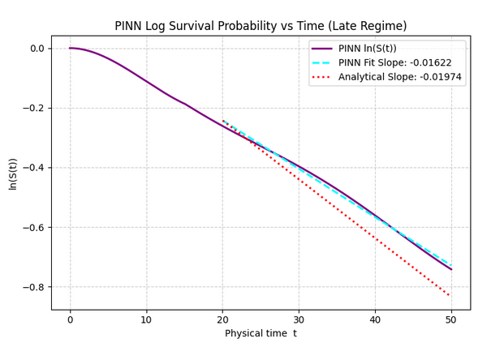
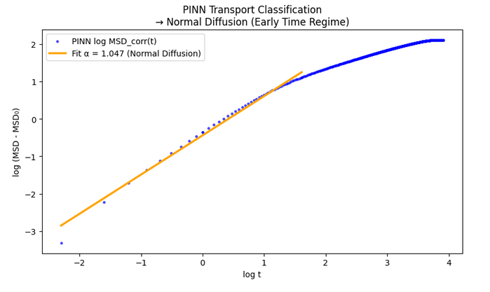
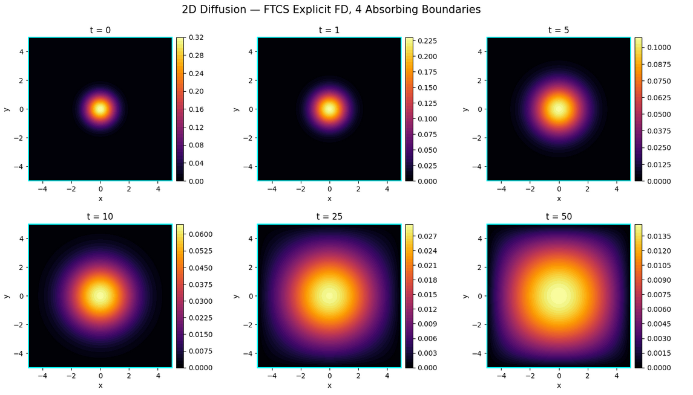
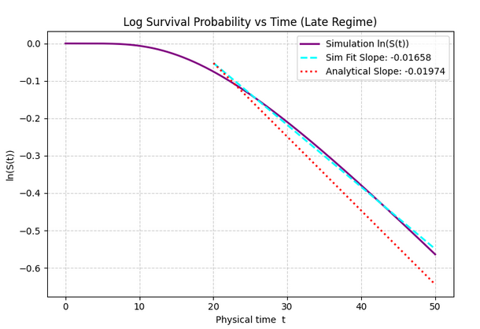
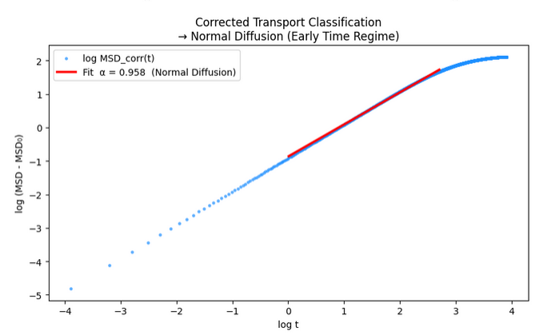

# Two-Dimensional Diffusion
## PINN vs Finite Difference Method

This project investigates diffusion in a bounded two-dimensional domain using both Physics-Informed Neural Networks (PINNs) and Explicit Finite Difference Methods (FDMs).

The study extends the one-dimensional diffusion problem to two spatial dimensions and examines transport behavior through heatmap evolution, mean square displacement (MSD), survival probability, and late-time decay analysis.

---

## Overview

Diffusion in higher dimensions introduces richer spatial dynamics and more complex transport behavior.

A Gaussian probability distribution is initialized at the center of a square domain and evolves according to the two-dimensional diffusion equation under absorbing boundary conditions.

The project compares:

- Physics-Informed Neural Networks (PINNs)
- Explicit Finite Difference Methods (FDMs)

for modeling and analyzing the diffusion process.

---

## Governing Equation

The two-dimensional diffusion equation is

\[
\frac{\partial u}{\partial t}
=
D
\left(
\frac{\partial^2 u}{\partial x^2}
+
\frac{\partial^2 u}{\partial y^2}
\right)
\]

where

- \(u(x,y,t)\) is the probability density
- \(D\) is the diffusion coefficient

---

## Boundary Conditions

Absorbing boundaries are imposed on all four edges of the square domain:

\[
u(x,y,t)=0
\]

for

\[
x=x_{\min},\;x_{\max}
\]

and

\[
y=y_{\min},\;y_{\max}
\]

Particles reaching the boundaries are removed from the system.

---

## Analysis Performed

### Heatmap Evolution

The spatial density distribution is visualized at multiple times to examine how diffusion spreads throughout the domain.

---

### Survival Probability

The total probability remaining inside the domain:

\[
S(t)
=
\iint u(x,y,t)\,dx\,dy
\]

---

### Mean Square Displacement (MSD)

Transport dynamics are quantified through

\[
MSD(t)
=
\left\langle
(x-x_0)^2+(y-y_0)^2
\right\rangle
\]

---

### Transport Classification

Transport behaviour is classified using

\[
MSD(t)
\sim
t^\alpha
\]

where

- \(\alpha < 1\) → Subdiffusion
- \(\alpha \approx 1\) → Normal Diffusion
- \(\alpha > 1\) → Superdiffusion

---

### Late-Time Survival Decay

The logarithm of the survival probability is analyzed and compared against the theoretical decay rate obtained from the lowest eigenmode of the bounded diffusion problem.

---

## Methods

### PINN

The PINN framework enforces:

- Two-dimensional diffusion equation residual
- Initial condition
- Four absorbing boundary conditions

through automatic differentiation.

The network directly learns the solution over the entire spatio-temporal domain.

---

### Explicit FDM

The FDM implementation uses a two-dimensional FTCS scheme.

The numerical solution serves as a reference for validating the PINN predictions.

---

## Project Structure

```text
5_diffusion_2D
│
├── 01_PINN
│   ├── data.py
│   ├── model.py
│   ├── physics.py
│   ├── train.py
│   ├── evaluate.py
│   ├── transport_metrics.py
│   ├── visualize.py
│   └── run_2d_diffusion.py
│
├── 02_FDM
│   ├── solver.py
│   ├── transport_metrics.py
│   ├── visualize.py
│   └── run_2d_diffusion_fdm.py
│
└── README.md
```

---

## Running the Project

### PINN

```bash
python 01_PINN/run_2d_diffusion.py
```

### FDM

```bash
python 02_FDM/run_2d_diffusion_fdm.py
```

---

## Results

### PINN Heatmap Evolution



---

### PINN Survival Probability



---

### PINN MSD Analysis



---

### FDM Heatmap Evolution



---

### FDM Transport Classification



---

### FDM MSD Analysis



---

## Key Observations

- The initially localized Gaussian distribution spreads radially throughout the domain.
- Absorbing boundaries continuously remove probability mass from the system.
- Survival probability decreases monotonically with time.
- Mean Square Displacement exhibits diffusive scaling consistent with normal diffusion.
- Late-time survival decay follows the theoretical eigenmode prediction for a bounded square domain.
- PINN and FDM solutions show strong agreement across all transport metrics.

---

